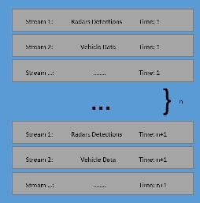
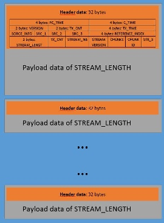

.. _Mudp Parser:

Aptiv Data Parsers
==================

This section describes Aptiv Mudp Data parser

This documentation (will) contain following parts:

* File format description
* Module architecture
* Usage
* How to contribute

File format description
-----------------------

MUDP is binary format for log data storage. It is split into streams which contains information about specific module: i.e. stream with radars detections or vehicle state. The amount of stream of every type is equal to length of log.

Every stream divides into header and payload. The header is fixed size (32 bytes) and includes information about a.o. stream type, version and payload length. The payload contains recorded data in binary format.

To decode payload data, the declaration file for specific stream version is needed (i.e. strdef_src035_str003_ver011.txt: source = 35, stream = 3, version = 11). From this file we get consecutive data types and their names, and base on this it is possible to parse data.::

            14                         # length of data (bytes)
            Int8 time
            float veh_x
            float veh_y
            PADDING2                   # empty 2 bytes
            REPEAT2                    # repeat start (2 times)
            char sensor_ID
            bool sensor_active
            END_REPEAT                 # end repeat start (2 times)

.. automodule:: aptivdataparsers.AptivDataParser.MudpParser.mudp_parser
   :members:

