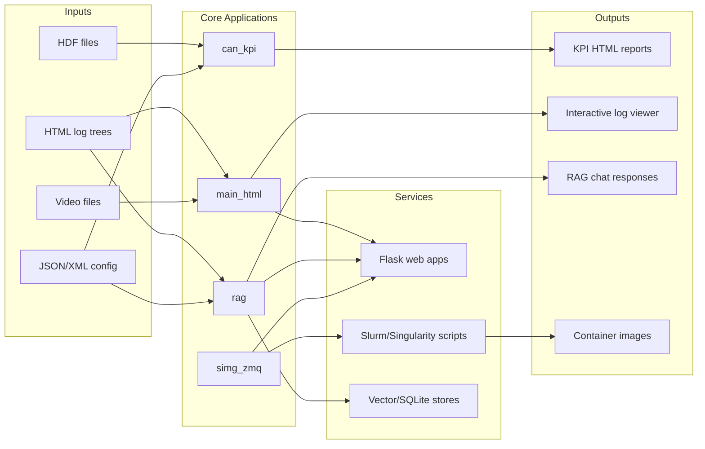

# plotly_code

Integrated toolkit for automotive log processing and visualization. This repository contains multiple related tools:

- CAN KPI report generation from HDF inputs
- Interactive HTML/video log viewer (offline and online)
- RAG-based assistant for querying ingested HTML logs with local models
- HPC-oriented service packaging (Singularity images and helper scripts)

## Overview

The codebase is organized as several runnable modules that share a similar workflow:

1. Read source logs/configuration.
2. Parse and transform data.
3. Generate KPI/HTML outputs or serve web APIs.
4. Optionally package and run on HPC infrastructure.

## Architecture Diagram



## Repository Structure

```text
plotly_code/
    README.md
    requirements.txt
    .gitignore

    can_kpi/
        kpi_main.py
        kpi.json
        a_persistence_layer/
        b_data_storage/
        c_business_layer/
        d_presentation_layer/

    main_html/
        all_services/
            app.py
            main_html/
            tools/
            scripts/
            simg/
        code/
            main.py
            html_offline/
            html_online/
            singularity/

    rag/
        main.py
        run.py
        app/
        tests/
        tools/
        data/
        model/

    simg_zmq/
        app.py
        main_html/
        rag/
        scripts/
        simg_sh_hpcc/
```

## Component Details

### 1) `can_kpi`

Purpose: generate KPI HTML reports from configured HDF input/output pairs.

Key entrypoint:

- `can_kpi/kpi_main.py`

Run example:

```bash
python can_kpi/kpi_main.py can_kpi/kpi.json can_kpi/out_html
```

What it produces:

- Per-pair HTML reports
- `index.html` summary page linking generated reports

### 2) `main_html`

Purpose: HTML/video log viewing and service orchestration for offline/online/HPC usage.

Key paths:

- `main_html/code/main.py` (viewer tooling entry)
- `main_html/all_services/app.py` (service launcher)
- `main_html/code/singularity/` (image and job scripts)

Common operations:

```bash
pip install -r requirements.txt
python main_html/all_services/app.py
```

### 3) `rag`

Purpose: local-model RAG service for ingesting HTML logs and answering questions.

Key entrypoints:

- `rag/main.py`
- `rag/run.py`

Common operations:

```bash
pip install -r rag/requirements.txt
python rag/main.py --scrap "C:\path\to\html_root" --embed --reset-index
python rag/main.py --talk
```

Default local endpoint:

- `http://127.0.0.1:5000/`

### 4) `simg_zmq`

Purpose: HPC-oriented wrapper workspace combining web services, RAG, and container scripts.

Key entrypoint:

- `simg_zmq/app.py`

## Setup

## Prerequisites

- Python 3.10+ recommended
- Git
- Optional: Singularity/Apptainer and Slurm for HPC deployment

## Local Setup

```bash
python -m venv .venv
# Windows
.venv\Scripts\activate
# Linux/macOS
source .venv/bin/activate

pip install -r requirements.txt
```

## Data and Git Policy (Important)

This repository is configured to keep heavy artifacts out of Git.

- Keep only lightweight source/config/test data in Git.
- Do not commit model binaries, vector databases, containers, executables, or build outputs.
- Target rule: keep committed files under `100 MB`.

Quick check before commit:

```bash
git ls-files | xargs -I{} sh -c 'test -f "{}" && ls -l "{}"' | sort -k5 -nr | head
```

On PowerShell:

```powershell
git ls-files | ForEach-Object {
    if (Test-Path $_) {
        $f = Get-Item $_
        if (-not $f.PSIsContainer) {
            [PSCustomObject]@{Path=$_; SizeMB=[math]::Round($f.Length/1MB, 2)}
        }
    }
} | Sort-Object SizeMB -Descending | Select-Object -First 20
```

## Development Notes

- There are multiple independent `requirements.txt` files under subprojects.
- Prefer installing per-subproject dependencies when working in a specific module.
- Large runtime data is intentionally ignored by `.gitignore`.

## License

No explicit license file is currently present at repository root. Add a `LICENSE` file if distribution terms are required.
