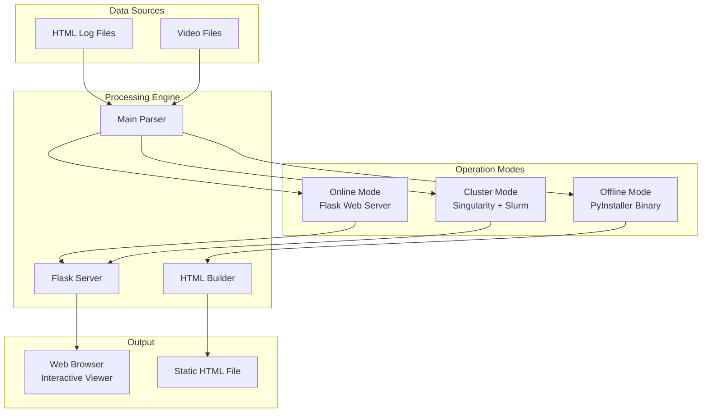

# plotly_code 📊🔍

[](https://github.com/krishnakumarbhat/plotly_code/actions/workflows/ci.yml)
[](https://python.org)

A **log viewer and data visualization** tool — renders HTML log files with integrated video playback, supports offline/online modes, and can be deployed on HPC clusters via Singularity containers.

## 🏗️ Architecture



## 🚀 Features

- **Offline Mode** — Build standalone HTML viewers as single-file executables
- **Online Mode** — Flask web server for LAN/cluster access
- **Cluster Deployment** — Singularity container with Slurm job submission
- **Cross-Platform** — Windows and Linux executables via PyInstaller
- **Interactive** — HTML log browsing with integrated video playback

## 🛠️ Tech Stack

| Component | Technology                 |
| --------- | -------------------------- |
| Backend   | Python, Flask              |
| Frontend  | HTML, Plotly.js            |
| Packaging | PyInstaller                |
| Cluster   | Singularity, Slurm         |
| Build     | Spec files (Windows/Linux) |

## 📦 Installation

### Python (Online Mode)

```bash
pip install -r requirements.txt
cd main_html/code
python main.py --serve [html_root] [video_root] --host 0.0.0.0 --port 5000
```

### Build Executables

```bash
# Linux
pip install pyinstaller
pyinstaller main_html/code/log_viewer_linux.spec

# Windows
pyinstaller main_html/code/log_viewer_windows.spec
```

## ▶️ Usage

```bash
# Offline — generate static viewer
./log_viewer <html_root> <video_root> [output.html]

# Online — start web server
python main.py --serve db/html db/video --host 0.0.0.0 --port 5000

# Cluster — Slurm job
sbatch slurm_log_viewer.sh
```

## 📁 Project Structure

```
plotly_code/
├── main_html/
│   ├── code/
│   │   ├── main.py                  # Entry point
│   │   ├── readme.md                # Build instructions
│   │   ├── log_viewer_linux.spec    # Linux PyInstaller spec
│   │   ├── log_viewer_windows.spec  # Windows PyInstaller spec
│   │   ├── singularity/            # Cluster deployment
│   │   │   ├── build_image.sh
│   │   │   ├── run_log_viewer.sh
│   │   │   └── slurm_log_viewer.sh
│   │   ├── db/                     # Database/data store
│   │   ├── html_offline/           # Offline HTML templates
│   │   └── html_online/            # Online server templates
│   └── all_services/               # Service modules
├── requirements.txt
├── .github/workflows/              # CI/CD pipeline
├── .gitignore
└── README.md
```

## 🖥️ Cluster Deployment

### Build Singularity Image

```bash
bash main_html/code/singularity/build_image.sh
```

### Submit Slurm Job

```bash
sbatch slurm_log_viewer.sh
# Check: squeue -u $USER
# Access: http://<node-ip>:5000/
```

## 📝 License

MIT License
