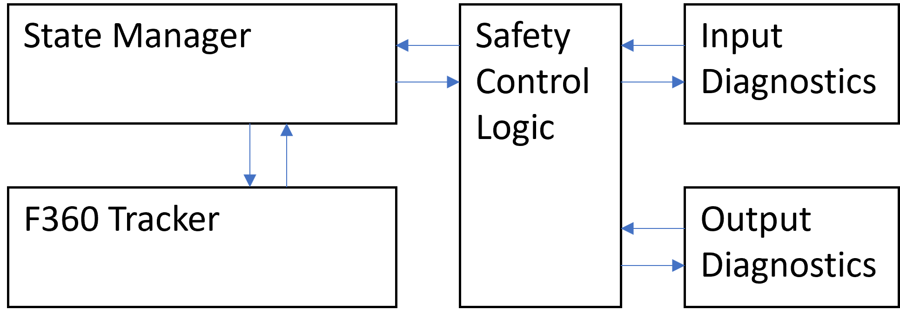
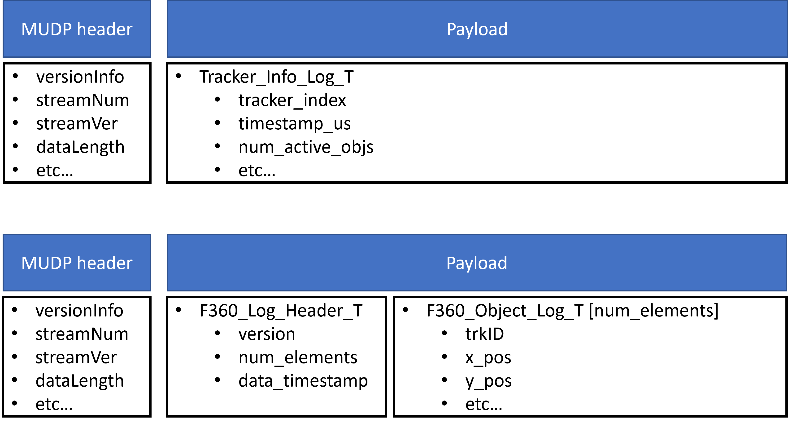
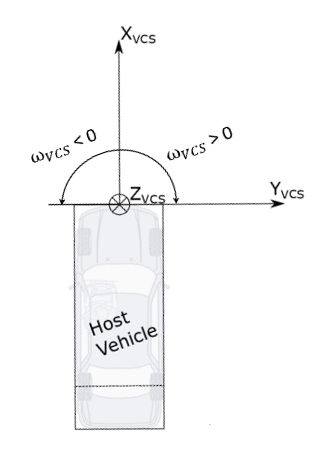

<!---
Reading and editing the guideline is easy with vscode https://code.visualstudio.com/download
Use the markdown preview to see the formatted output as you edit "Ctrl + Shift + V"

Export the guideline to HTML with the "Markdown PDF" extension in vscode (yzane.markdown-pdf)
-->
# ROT Integration Guideline
Updated 2024-04-03
## Table of Contents
1. [Preface](#Preface)
1. [State Manager Overview](#state-manager-overview)
1. [Tracker Class Overview](#tracker-class-overview)
1. [Input Interface](#input-interface)
1. [Output and Logging Interface](#output-and-logging-interface)
1. [Tracker execution](#tracker-execution)
1. [Building the tracker](#building-the-tracker)
1. [Integrating the tracker](#integrating-the-tracker)
   * [Step 1: Running a test program](#step-1-running-a-test-program)
   * [Step 2: Logging](#step-2-logging)
   * [Step 3: Populating inputs and running the tracker](#step-3-populating-inputs-and-running-the-tracker)
   * [Optional: Building and running tracker without occupancy grid](#optional-building-and-running-tracker-without-occupancy-grid)
1. [Parsing Log Data](#parsing-log-data)
1. [Integration Tests](#integration-tests)
1. [Appendix](#appendix)

# Preface
<span style="color:red"> **This document and the integration guideline document for the RSPP component should be read in their entireties before attempting to integrate either component.** </span>
The tracker is built in C++ and measured for compliance against MISRA C++ 2008. Additionally, the tracker is extensively tested with CPPUtest and evaluated for regression using real world data through ASTP. For the real world test data, an execution period of 50 ms is used.

The release package contains test specifications and reports for Integration-, Qualification-, and Unit-Testing. Additionally, it contains a static code analysis report summary of any MISRA C++ 2008 rule violations, a software complexity report, as well as a code coverage summary.

The tracker has been successfully compiled with the following:
- MSVC 2015
- GCC 7.5.0
- Tasking Tricore v6.3
- Windriver diab-5.9.6.4
- QNX 7.1.0

The tracker is wrapped in a namespace which corresponds to the variant that it built as; `f360_variant_A`, `f360_variant_B` or `f360_variant_C` etc.

The tracker has a set of pre-defined output structs which shall be used and the required log structures must be logged according to the directions contained herein. Any changes to the supplied definitions will likely result in rejection of reported issues.

The Radar Object Tracker is dependent on the Radar Sensor Preprocessing (RSPP) component to provide processed detections and the Occupancy Grid (OCG) if that is applicable to the specific project setup. <span style="color:red"> **Note:** </span> that RSPP and ROT variants must be the same. The OCG also has variants that correspond to specific RSPP variants, this is to be defined by the OCG team.

# State Manager Overview
The state manager is the main object to control execution of the tracker, meaning the <span style="color:red">**tracker should not be executed separately, but only via the State Manager**</span>. Once the state manager is set up it will interface Input and Output diagnostics components through a safety control logic component  to ensure that signals are in the expected range.


A simplified view of how the different components are connected

The safety control logic component has methods to get the current fault status for inputs, outputs and SCL overall. This information can be used to eg. send fault status to downstream components and inform integrators that some data could be populated incorrectly.

## State manager function overview
The State Manager has a set of public functions mentioned below.

`Initialize()`\
An initialization method that will set up calibration values and the correct starting values of various internal tracker variables. Note that this method is overloaded. In an embedded environment, the variant argument shall not be used.\
**Must be called once before executing the tracker.**

`Initialize(variant)`\
Used in resim environment to set tracker variant in runtime. Not to be used in the embedded system.

`Execute()`\
Call to execute the tracker. Assumes that all inputs are populated, consistent and valid.
There are two variants of the Execute function, with and without Occupancy Grid input, the appropriate variant to be called depends on if there is an Occupancy Grid in the system or not.

`Initialize_Tracker_State_From_Log()`\
Used in resim environment to set the tracker to a specific state. Not to be used in the embedded system.

`Log_Functional_Safety_Faults()`\
Used to log functional safety data/tracker input and output fault information.


# Tracker Class Overview
The tracker class is defined in the `f360_tracker.h` file. The available class methods and a corresponding brief descriptions will be detailed here.
Apart from the functions mentioned below the tracker class also has implementations of the State Manager functions mentioned in the previous chapter. These functions should **only** be called from the State Manager.

`Reset()`\
Similar to `Initialize()` but not as extensive. To be used if the tracker needs to be reset for any reason during runtime.

`Get_Version()`\
Used to get the major, minor, patch and build version.

`Log_Tracker_Info()`,
`Log_F360_Host_Props()`,
`Log_Timing_Info()`,
`Log_Static_Env_Polys()`,
`Log_Host_Calibs()`,
`Log_Vehicle_Info()`,
`Log_Sync_Info()`,
`Log_Timing_Info()`,
`Log_Trailer_Detector()`\
Population of fixed size log structs.

`Log_Objects()`,
`Log_Detections()`,
`Log_Sensor_Calibs()`,
`Log_Internal_Clusters()`,
`Log_Internal_Objects()`,
`Log_Internal_Detection_History()`,
`Log_Internal_CWD()`,
`Log_Internal_Reflection_Buffer()`\
Population of variable size log structs.

See the [Output and Logging Interface](#output-and-logging-interface) chapter for detailed signal definitions. See the [Logging requirements](#logging-requirements) chapter for further clarification on optional and required logging.

# Input Interface
When calling the `Execute()` method of the State Manager, 5 structs are passed to the tracker containing data that needs to be populated outside the tracker. The definition of the signals in these structs are defined here.

For definitions with respect to coordinate systems, please refer to Chapter 5 in the following requirements document: https://polarionprod1.aptiv.com/polarion/#/project/F360TrackerCoreProject/wiki/SYS_Requirements/Abbreviations_Definitions_TrackerCore

Project integration teams need to ensure that all the input data is available and updated for each cycle. In case an input struct is not able to be populated it should be cleared rather than sending old/invalid data.

## `F360_Core_Info_T`
| signal | description |
| :--- | :--- |
| `cnt_loops` | Counter that increases every tracker iteration |
| `time_us`   | Time in microseconds |
| `prev_time_us` | Previous time in microseconds |
| `elapsed_time_s` | Time elapsed since the previous tracker execution |

## `F360_Host_T`
The vehicle coordinate system (VCS) is defined in the Appendix of this document.

| signal | description |
| :--- | :--- |
| `vehicle_index` | index of VSE iteration |
| `speed` | m/s, **signed** total speed at rear axle, negative speed implies that host is reversing. |
| `vcs_speed` | m/s, **signed** total speed at VCS origin (front bumper), negative speed implies that host is reversing. |
| `acceleration` | m/s^2, total acceleration at rear axle |
| `vcs_lat_acceleration` | m/s^2, at VCS origin |
| `vcs_long_acceleration` | m/s^2, at VCS origin |
| `yaw_rate_rad` | rad/s, in VCS, compensated for bias |
| `vcs_sideslip` | rad, signal range (-pi/2, pi/2) at VCS, check definition from VSE - might need to be converted from range -pi/pi |
| `curvature_rear` | 1/m, at rear axle |
| `dist_rear_axle_to_vcs_m` | distance between the rear axle and the VCS origin (front bumper) in meters, <span style="color:red">**always a positive value**</span> |
| `rear_cornering_compliance` | calibration value |
| `speed_correction_factor` | speed = scf * raw_speed (used only for debug) |
| `f_trailer_presence_hardware` | trailer presence detected by the host vehicle electronically |
| `speed_qf` | quality flag (used only for debug) |
| `yaw_rate_qf` | quality flag (used only for debug) |
| `lat_accel_qf` | quality flag (used only for debug) |
| `long_accel_qf` | quality flag (used only for debug) |


## `OCG_Outputs_T`
This input is optional. Configurations where occupancy grid is not applicable must follow instructions in (#building-without-occupancy-grid). OCG_Outputs_T contains two structs `OCG_Definition_T` and `OCG_Underdrivability_T` along with the signals timestamp, f_valid and iteration_index. 

## `RSPP_Detection_List_T`
This struct is the output of the RSPP component. Please see the documentation for that component for more information on how to populate this data structure.
 
## `F360_Radar_Sensor_T`
This data structure is shared between ROT and RSPP.
For a full description of this data structure and how to populate it, please refer to the Radar Sensor Preprocessing (RSPP) integration guideline.

# Output and Logging Interface
This chapter describes the two primary output interfaces available to downstream users along with a list of required log structures.

<span style="color:red">**Note that apart from this list we also require that
all project teams shall reproduce the radar platform detection interface and provide it in .mudp,.dvl,.brr, or .mf4 format in order for the tracker team to be able to work with the data.**</span>

This input logging is **not** defined in the log structs below.
Assumption is that the input logging is done outside of the tracker library.

We would also recommend not to log too long sequences in a single log file as this can also make the data difficult to work with due to work station RAM limitations. Recommended log duration is 20 seconds.

## `ROT_Object_List_Info_T`

The ROT_Object_Output_T contains a downselected/reduced object list intended for customer programs, it also contains fault information (All_SCL_Faults_T) from the Safety Control Logic.

This object list is in **ISO** coordinate system and objects have been downselected meaning all objects are qualified to use. Every customer program team should apply a final mapping level on this list to ensure the correct signal names are used and that the final interface does not contain undesired signals.
There is no log stream for this data structure.

## `F360_Object_Log_Output_T`
 
 Default object list information in **VCS** coordinate system. Struct size varies with tracker variant to optimize memory usage and bandwidth requirements. This structure is intended for internal stakeholders only. This list of objects is not downselected meaning <span style="color:red">**only the objects that have a reduced_id > 0 are qualified for use!**</span>


## Complete list of log interfaces
All of the below data structures need to be logged in order for the tracker team to do debugging of incoming problems via resim. The internal structures mentioned at the bottom are required to meet the high resim reproducibility demands that are often required by our customers.

Log functions are available for all of these structures, they are mentioned in chapter [Tracker Class Overview](#tracker-class-overview) apart from the `Functional_Safety_Faults_Log_T` which has its logging function in the State Manager mentioned in [State Manager Overview](#state-manager-overview). There is also a hands on example in code on how to do the logging here [Step 2: Logging](#step-2-logging)

| Stream number | Log struct | description | required |
| :--- | :--- | :--- | :--- |
| 1 |`Sync_Info_Log_T`| Timestamps and execution indices | Yes|
| 4 |`Vehicle_Info_Log_T`| Host vehicle information, partially produced by a VSE, partially raw data | Yes|
| 7 | `Tracker_Info_Log_T` | Contains high level information about the tracker state | Yes |
| 9 | `Timing_Info_Log_T` | Profiling information | Yes |
| 12 |`Host_Calibs_Log_T`| Host vehicle properties | Yes|
| 14 | `F360_Host_Props_Log_T` | Information about the state of the vehicle | Yes |
| 19 | `F360_Static_Env_Poly_Log_T` | Description of the static environment around the host vehicle, eg. guardrails. | Yes |
| 22 |`Functional_Safety_Faults_Log_T`| Functional safety fault information from tracker input and output checks. This data comes from the state manager and not the tracker itself | Yes |
| 70 |`F360_Object_Log_Output_T`| See description in the beginning of this chapter | Yes|
| 71 | `F360_Detection_Log_Output_T` | Derived detection information produced by the tracker. Variable size to optimize memory usage and bandwidth requirements | Yes |
| 72 |`F360_Sensor_Calib_Log_Output_T`| Collection of sensor calibration parameters | Yes|
| 86 |`Trailer_Detector_Log_T`| Trailer detection data| Yes|
| 150 | `F360_Internal_Object_Log_Output_T` | Internal tracker state, variable size | Yes for high resim reproducibility |
| 151 | `F360_Internal_Cluster_Log_Output_T` | Internal tracker state, variable size | Yes for high resim reproducibility |
| 152 | `F360_Internal_Detection_History_Log_Output_T` | Internal tracker state, variable size | Yes for high resim reproducibility |
| 154 | `F360_Internal_Reflection_Buffer_Log_Output_T` | Internal tracker state, variable size | Yes for high resim reproducibility |
| 155 | `F360_Internal_CWD_Log_Output_T` | Internal tracker state, variable size | Yes for high resim reproducibility |


All log structs should be handled as a payload with a valid `MUDP` header. The header files for the different log structs contain their stream number and stream version. Chunking is required when the payload exceeds 32kB.

# Tracker execution
Before any execution takes place the tracker needs to be initialized.
The state manager has an `Initialize()` function but this is automatically invoked in the constructor of the state manager, it does not need to be invoked explicitly.

Then, before iteration of tracker execution, the input data structures are expected to be updated, see [Input Interface](#input-interface) for further details. A function is provided to update the motion of the sensors mounted on the vehicle: `F360_Update_Sensor_Motion()`. 

An assumption is that a **VSE** has been run which provides refined host state information. Additionally, **auto-alignment** should be executed to estimate the difference in actual mounting from nominal mounting. Since these components are program specific, no further details will be provided here.

**RSPP** should be executed to provide the input `RSPP_Detection_List_T` to tracker(please refer to [rspp integration document](./rspp_integration_guideline.md)). 

During tracker execution, data can at any time be accessed from the various input structures. Each program bears the responsibility to ensure that no data is being written to the input structures during tracker execution.

After calling `state_manager->Execute()` the required (and possibly the optional) data structures should be logged. See [Logging](#logging-requirements) for a list of these structures.
They can be logged using the logging functions described in [Tracker Class Overview](#tracker-class-overview)),
These functions will copy data from the tracker's internal memory to the log structs. There is no need to access the tracker's internal memory during runtime.

After logging the default radar tracker object output interface can be obtained by calling the function `f360_tracker->Fill_ROT_Object_Output()`.

Please refer to the example wrapper file for more details.

# Building the tracker
The tracker is expected to be delivered as a prebuilt library in the near future. Do **not** modify the tracker sources without informing the tracker development team as there will likely be problems when integrating the prebuilt library later on.

CMake files are used to configure build environments for the resim and trackerPC applications. A toolchain with limited functionality for Tasking TriCore exists but since linking requires a program specific .lsl file, it cannot be simply dropped into projects. Some additional information can be found on Confluence: https://confluence.asux.aptiv.com/display/F360Core/CMake

Part of the CMake configuration allows for the selection of a variant to build. The effect of this is that different variants from the [variants folder](../sw/F360TrackerLib/SharedTrackerAPI/core/variants) replaces the `f360_variant_definition.h`. There are different variants corresponding to different customer programs and integrators need to select the appropriate one in order to ensure that the tracker runs as expected. Additionally, the cmake system will generate a folder with variant specific interfaces which shall be used. The folder will be located in your specified build folder and be named "`iface_variant_*`". If unsure of which variant should be used for a given project, reference in `index.txt` file in the variants folder.

Observe that different variant definitions have different namespaces. In order to also build everything else with the same namespace, the C Preprocessor is used to specify the default namespace name as a symbol and thereby overwriting it with the appropriate namespace name. Exactly how this is done can be seen in the `CMakeLists.txt` file for the trackerLib.

If the state manager (`State_Manager.h`) is used, the tracker will be monitored for various failures which can result from either bad input or something going wrong inside the tracker. The fault can be accessed from the `SafetyControlLogic` object. See `Log_Functional_Safety_Faults()` for examples.

The `f360_constants.h` and `f360_variant_definition.h` contain information about how many sensors are in use, which types of sensors are used, how many objects should be tracked, and more. Please consult the tracker team if changes to these constants are required. If changes are made without the involvement of the tracker team it will cause significant issues.

# Integrating the tracker
## Preface
We will assume from here on that the tracker has been compiled and archived into a library. Below sections describe how to integrate the tracker, setup logging and how to run it. There is a code snippet below that shows how to run a basic test program but please **note that there is a more thorough wrapper example supplied in the ROT release package under the folder Example_Tracker_Wrapper that is more suitable for atual integration. All values/constants assigned in that example code are to be updated based on the host vehicle and sensor parameters**.

## Step 1: Running a test program
In order to ensure that the tracker can be successfully linked into the build system we will start off by defining a simple wrapper which will create an instance of the tracker and feed it the bare minimum of inputs to see that it can execute successfully.

The sample code below below assumes two instances of different variants. The integrator must change the namespace name to match the correct variant, and if only a single instance is used, the other should be removed.

If the below code compiles successfully, then the minimum requirements for integration are met. If the code can be executed with a connected debugger and function returns zero, then the bare minimum of qualification is met.


```C++
#include "iface_variant_B/core/State_Manager.h"
#include "iface_variant_B/core/f360_input_diagnostics.h"
#include "iface_variant_B/core/f360_output_diagnostics.h"
#include "iface_variant_B/core/f360_safety_control_logic.h"
#include "iface_variant_B/core/f360_tracker.h"

#include "iface_variant_C/core/State_Manager.h"
#include "iface_variant_C/core/f360_input_diagnostics.h"
#include "iface_variant_C/core/f360_output_diagnostics.h"
#include "iface_variant_C/core/f360_safety_control_logic.h"
#include "iface_variant_C/core/f360_tracker.h"

#include "rspp_iface_variant_B/rspp_calibrations.h"
#include "rspp_iface_variant_C/rspp_calibrations.h"

#include "rspp_iface_variant_B/rspp_inputs_preprocessing.h"
#include "rspp_iface_variant_C/rspp_inputs_preprocessing.h"

#include "rspp_iface_variant_B/rspp_host.h"
#include "rspp_iface_variant_B/rspp_core_info.h"


#include "rspp_iface_variant_B/rspp_host.h"
#include "rspp_iface_variant_C/rspp_core_info.h"
/* Support functions */
template<typename T>
static void Advance_Core_Info(T &core_info)
{
   core_info.cnt_loops++;
   core_info.elapsed_time_s = 0.05f;
   core_info.prev_time_us = core_info.time_us;
   core_info.time_us += 50000;
}

template<typename T>
static void Advance_Sensor(T &sensor, const  uint64_t time_us)
{
   sensor.variable.look_index++;
   sensor.variable.look_id = (sensor.variable.look_id == RSPP_DET_LOOK_ID_0) ? RSPP_DET_LOOK_ID_1 : RSPP_DET_LOOK_ID_0;
   sensor.variable.timestamp_us = time_us;
   sensor.variable.vacs_boresight_azimuth_angle = sensor.constant.mounting_position.vcs_boresight_azimuth_angle; // considering no misalignment
   sensor.variable.vacs_boresight_elevation_angle = sensor.constant.mounting_position.vcs_boresight_elevation_angle; // considering no misalignment

}

template<typename T>
static void Init_Single_Detection(T &raw_det_list)
{
   raw_det_list.number_of_valid_detections = 1;
   raw_det_list.detections[0].raw.range = 14.5f;
   raw_det_list.detections[0].raw.range_rate = 0.0f;
   raw_det_list.detections[0].raw.sensor_id = 1;
}

template<typename RSPP_T, typename Host_T>
static void Set_RSPP_Host_Info(RSPP_T &rspp_host, Host_T &host)
{
   rspp_host.vehicle_index = host.vehicle_index;
   rspp_host.speed = host.speed;
   rspp_host.vcs_speed = host.vcs_speed;
   rspp_host.acceleration = host.acceleration;
   rspp_host.vcs_lat_acceleration = host.vcs_lat_acceleration;
   rspp_host.vcs_long_acceleration = host.vcs_long_acceleration;
   rspp_host.yaw_rate_rad = host.yaw_rate_rad;
   rspp_host.vcs_sideslip = host.vcs_sideslip;
   rspp_host.curvature_rear = host.curvature_rear;
   rspp_host.dist_rear_axle_to_vcs_m = host.dist_rear_axle_to_vcs_m;
   rspp_host.rear_cornering_compliance = host.rear_cornering_compliance;
   rspp_host.speed_correction_factor = host.speed_correction_factor;
   rspp_host.speed_qf = host.speed_qf;
   rspp_host.yaw_rate_qf = host.yaw_rate_qf;
   rspp_host.lat_accel_qf = host.lat_accel_qf;
   rspp_host.long_accel_qf = host.long_accel_qf;
   
}

template<typename RSPP_Core_T, typename Core_Info_T>
static void Set_RSPP_Core_Info(RSPP_Core_T &rspp_core_info, Core_Info_T &core_info)
{
   rspp_core_info.cnt_loops = core_info.cnt_loops;
   rspp_core_info.elapsed_time_s = core_info.elapsed_time_s;
   rspp_core_info.prev_time_us = core_info.prev_time_us;
   rspp_core_info.time_us = core_info.time_us;

}

template<typename T>
static void Init_Sensor_Calibs(T &sensor)
{
   sensor.variable.f_ant_sens_available = false;
   sensor.constant.id = 1;
   sensor.variable.is_valid = true;
   sensor.constant.v_wrapping[0] = 70.0f;
   sensor.constant.v_wrapping[1] = 60.0f;
   sensor.constant.r_wrapping[0] = 0.0f;
   sensor.constant.r_wrapping[1] = 0.0f;
   sensor.constant.polarity = 1;
   sensor.constant.mounting_location = RSPP_MOUNTING_LOCATION_CENTER_REAR;
   sensor.constant.mounting_position.vcs_position.lateral = 0.0f;
   sensor.constant.mounting_position.vcs_position.longitudinal = -4.5f;
   sensor.constant.mounting_position.vcs_boresight_azimuth_angle = 3.1415926f;
   sensor.constant.mounting_position.vcs_boresight_elevation_angle = 0.0F;

}

template<typename T1, typename T2>
static void Sensor_Motion_Update(T1& host_info, T2& sensor)
{
   // here only considered a simple version of host move straight forward for the RSPP integration test
   float xsens = 0.0f;
   float ysens = 0.0f;
   xsens = host_info.dist_rear_axle_to_vcs_m + sensor.constant.mounting_position.vcs_position.longitudinal;
   ysens = sensor.constant.mounting_position.vcs_position.lateral;
   sensor.variable.vcs_velocity.longitudinal = host_info.vcs_speed;
   sensor.variable.vcs_velocity.lateral = 0;

}
/* Test description
   Scenario:
      - The host moves straight with 10 m/s speed.
      - Single target (as single detection) is behind the host

   Expected output (test pass criteria):
      - An object created.
*/

int main()
{
   static f360_variant_B::F360_Tracker f360tracker_B;
   static f360_variant_B::Input_Diagnostics input_diag_B;
   static f360_variant_B::Output_Diagnostics output_diag_B;
   static f360_variant_B::SafetyControlLogic SCL_B(input_diag_B, output_diag_B);
   static f360_variant_B::State_Manager SM_B(SCL_B, f360tracker_B);
   static f360_variant_B::F360_Host_T host_B{};
   static rspp_variant_B::RSPP_Calibrations_T rspp_calibs_B;
   static rspp_variant_B::RSPP_Detection_List_T detection_list_B{};
   static f360_variant_B::F360_Core_Info_T core_info_B{};
   static rspp_variant_B::F360_Radar_Sensor_T sensors_B[rspp_variant_B::MAX_NUMBER_OF_SENSORS]{};
   static f360_variant_B::F360_Object_Log_Output_T obj_log_B;
   static Tracker_Info_Log_T tracker_info_log_B{};

   static f360_variant_C::F360_Tracker f360tracker_C{};
   static f360_variant_C::Input_Diagnostics input_diag_C;
   static f360_variant_C::Output_Diagnostics output_diag_C;
   static f360_variant_C::SafetyControlLogic SCL_C(input_diag_C, output_diag_C);
   static f360_variant_C::State_Manager SM_C(SCL_C, f360tracker_C);
   static f360_variant_C::F360_Host_T host_C{};
   static rspp_variant_C::RSPP_Calibrations_T rspp_calibs_C;
   static rspp_variant_C::RSPP_Detection_List_T detection_list_C{};
   static f360_variant_C::F360_Core_Info_T core_info_C{};
   static rspp_variant_C::F360_Radar_Sensor_T sensors_C[rspp_variant_C::MAX_NUMBER_OF_SENSORS]{};
   static f360_variant_C::F360_Object_Log_Output_T obj_log_C;
   static Tracker_Info_Log_T tracker_info_log_C{};

   //RSPP
   static RSPP_Core_Info_T rspp_core_info_B{};
   static RSPP_Host_T rspp_host_B{};
   
   static RSPP_Core_Info_T rspp_core_info_C{};
   static RSPP_Host_T rspp_host_C{};


   f360tracker_B.Initialize();
   f360tracker_C.Initialize();
   host_B.vcs_speed = 10.0f;
   host_C.vcs_speed = 10.0f;

   const uint32_t max_nb_loops = 20U;
   while((0 == tracker_info_log_B.reduced_num_active_objs)
      && (max_nb_loops > core_info_B.cnt_loops))
   {
      Init_Single_Detection(detection_list_B);
      Init_Single_Detection(detection_list_C);

      Advance_Core_Info(core_info_B);
      Advance_Core_Info(core_info_C);

      
      Init_Sensor_Calibs(sensors_B[0]);
      Init_Sensor_Calibs(sensors_C[0]);

      Advance_Sensor(sensors_B[0], core_info_B.time_us);
      Advance_Sensor(sensors_C[0], core_info_C.time_us);

      Sensor_Motion_Update(rspp_host_B, sensors_B[0]);
      Sensor_Motion_Update(rspp_host_C, sensors_C[0]);

      Set_RSPP_Host_Info(rspp_host_B,host_B);
      Set_RSPP_Host_Info(rspp_host_C,host_C);
      Set_RSPP_Core_Info(rspp_core_info_B,core_info_B);
      Set_RSPP_Core_Info(rspp_core_info_C,core_info_C);


      rspp_variant_B::Initialize_RSPP_Calibrations(rspp_calibs_B);
      rspp_variant_C::Initialize_RSPP_Calibrations(rspp_calibs_C);

      rspp_variant_B::Inputs_Preprocessing(rspp_core_info_B,rspp_host_B,sensors_B,rspp_calibs_B,detection_list_B);
      rspp_variant_C::Inputs_Preprocessing(rspp_core_info_C,rspp_host_C,sensors_C,rspp_calibs_C,detection_list_C);


      SM_B.execute(core_info_B, host_B, detection_list_B, reinterpret_cast<f360_variant_B::F360_Radar_Sensor_T(&)[rspp_variant_B::MAX_NUMBER_OF_SENSORS]>(sensors_B), obj_log_B);
      SM_C.execute(core_info_C, host_C, detection_list_C, reinterpret_cast<f360_variant_C::F360_Radar_Sensor_T(&)[rspp_variant_C::MAX_NUMBER_OF_SENSORS]>(sensors_C), obj_log_C);

      f360tracker_B.Log_Tracker_Info(&tracker_info_log_B);
      f360tracker_C.Log_Tracker_Info(&tracker_info_log_C);
   }

   int test_result;
   if (tracker_info_log_C.reduced_num_active_objs > 0)
   {
      test_result = 0;
   }
   else
   {
      test_result = -1;
   }

   return test_result;
}


```

## Step 2: Logging
The tracker object has methods for populating logging structs. Since we've already added an `#include` for the tracker class, we don't need to explicitly add new ones for the structs. There is also no need to update any constants as this is controlled by the variant definition. See the [Logging](#logging-requirements) chapter for additional required logging not provided by the trackerLib.

The data must be logged with a valid MUDP format which includes a header and a payload of maximum 32 kB. The header definition is not included with the release but it should look similar to

```C++
typedef struct UDPRecord_Header_Tag
{
   // Application Layer Info
   uint16_t versionInfo;
   uint16_t sourceTxCnt;
   uint32_t sourceTxTime;
   uint8_t  sourceInfo;
   uint8_t  reservedSrc1;
   uint8_t  reservedSrc2;
   uint8_t  reservedSrc3;
   // Process Layer Info
   uint32_t streamRefIndex;
   uint16_t streamDataLen;
   uint8_t  streamTxCnt;
   uint8_t  streamNumber;
   uint8_t  streamVersion;
   uint8_t  streamChunks;
   uint8_t  streamChunkIdx;
   uint8_t  reservedStr3;
}UDPRecord_Header_T;

```

The following is expected:
* The header shall be 24 bytes and immediately followed by the payload.
* `versionInfo` is defined, with UDP_RECORD_VERSION being 0xA1 if nothing else is defined, as
```C++
((UDP_RECORD_VERSION << 8) | sizeof(UDPRecord_Header));
```
* `sourceTxCnt` shall increase with every MUDP packet, regardless of stream, in order to identify packet drops.
* `sourceTxTime` shall be the current system time when the packet is constructed.
* `sourceInfo`, if nothing else is defined, shall be 35.
* For log structs that are larger than 32 kB, chunking shall be applied.
* Log structs with a  `F360_Internal_` prefix, should have a smaller maximum payload size which is defined in the corresponding header file for the struct definition. Additionally, only one chunk of this type should be transmitted per iteration. This will conserve bandwidth and a complete set will only be transmitted every 100 or more iterations depending on variant. Note that all log structs must be populated at the same time, and the data preserved as it is continuously logged.
* When chunking log structs, it is expected that all chunks but the last is using the full 32 kB.
* `streamRefIndex` shall correspond to the tracker index or `cnt_loops` in the `core_info` struct for all data streams produced by the tracker.
* `streamDataLen` shall correspond to the size of the payload, which does not include the MUDP header. Structs that are of "variable size" are always packed, meaning that the size of the full payload required to log (which may then be chunked as necessary) can be computed as
```C++
uint16_t log_size = sizeof(F360_Log_Header_T) + sizeof(F360_Internal_Object_T) * log->f360header.num_elements;
```
* `streamTxCnt` shall increase with every packet of the given stream.
* The `streamNumber` and `streamVersion` shall be updated to whichever stream number and version is specified in the log struct definition.
* The `streamChunks` field shall be determined by examining the current size of the log struct for the current iteration. This means the a given stream can some times have 1 chunks and other times 2 or more chunks.
* If the system is running more than one instance of the tracker, the `reservedSrc2` field shall be populated with the ID of the tracker. Each tracker must naturally have a unique ID determined by the integrator.
* `reservedSrc1`, `reservedSrc3`, and `reservedStr3` should be zero.

The MUDP packet can be encapsulated as a payload in a different protocol such as SOME/IP and logged in a different type of file if this is a requirement from the program. You are however expected to inform the tracker development team such that they can construct a converter back to their preferred format of .dvl and .mudp files.

## Step 3: Populating inputs and running the tracker
The tracker needs a number of inputs to be populated. The complete input list with details are documented in the [Input Interface](#input-interface) chapter.

In short, the following items should be completed

1. Update radar detection list with new detection data from sensors
2. Update sensors stucts with new information
3. Update core information with current timestamp etc.
4. Update Host data with output from Vehicle State Estimator
5. Execute tracker
6. Log Output

Additionally, before the first execution, the tracker needs to be initialized by calling the `Initialize()` method of the tracker class.

Some sample code to help with this can be found in the example wrapper.

## Optional: Building and running tracker without occupancy grid
Some tracker instances, primarily those that only process detections from side radars, may not be applicable for running a corresponding occupancy grid instance. In these situations, during compilation of the wrapper code, a symbol named `DISABLE_OCG` should be defined. This will define the `OCG_Outputs_T` as a simple struct containing a single byte, allowing compilation without including the OCG header files. 

The above mentioned symbol should only be defined duing compilation of the wrapper, and not for example, if compiling the tracker from source. Additionally, if two tracker instances are integrated in the same application, this functionality should not be used as it could result in conflicing definitions. However, one may still use the alternative execute method in the state manager to run the tracker without supplying a reference to the `OCG_Outputs_T` so as not to allocate unused memory.

# Parsing Log Data
Provided that the data has been logged according to specifications in the [Logging requirements](#logging-requirements) and [Integrating the tracker - Step 2: Logging](#step-2-logging) chapters, the logged data can be parsed using MATLAB [scripts](../sw/zResimSupport/read_mudp_data.m) in the OT repository. In order to enable the parsing of variable size streams, changes were implemented in the read_mudp_data.m and parse_mudp_data.m files. Note that if the data is encapsulated in for example an mdf container, the scripts will not work as they are intended to parse the data as logged by DVTool.

Depending on which stream is being parsed, different strategies need to be applied. Some streams have a constant size, in which case a simple approach to parsing the data can be applied. The header of the MUDP datagram can be plainly parsed using the provided definition and the stream for the current datagram can be identified along with the length of the payload which immediately follows the header. Since the payload is of fixed size, the entirety of the payload can be casted to the typedef'd struct of the log stream in question.

If the stream is of variable size, and logged as such (which is the case in the F360 TrackerPC and the resim executables), the MUDP header must first be parsed to identify the stream. Next, the payload can be parsed. The first part of the payload will contain an internal f360 header struct which will inform the user of how many elements of the log structure array are populated. See comparison in the figure below.



Note that in the example, the number of F360_Object_Log_T elements can be found in the first part of the MUDP payload, in the F360_Log_Header_T.

Depending on the environment, eg. a C/C++ program or a MATLAB script, different approaches to parsing the data must be applied. In a C/C++ program, it's quite simple to define a pointer which starts at the location of the actual log struct and iterate over the available data. One should however define a upper bound of how many elements can be received unless it's preferable to use dynamic memory allocation along with the associated overhead. Should the size of the F360_Log_Header_T type chance, the version field will be updated which ensures backwards compatibility and ensures that the location of where the log data starts can be reliably identified.

# Integration Tests

The following checks shall be carried out successfully before the tracker can be considered to have been integrated.

## Tracker Input Struct Check
* F360_Radar_Sensor_T -> ConstantProps_T
    * absolute value of aliased range_rate should not be bigger than range rate interval width. SRR 5 and 5+ is between [60, 70], MRR3, SRR6 and later products are between [30, 35]
    * sensor_id > 0
    * polarity is 1 (upright mounting) or -1 (upside down mounting).
    * mounting location - is mapped to tracker input interface `F360_Mounting_Location_T mounting_location`
    * mounting position - x, y and height should be less than 10 meters, and boresight angle in vcs coordinate with range [-PI, PI] (in radians) should be coreponding to its mounting location
    * sensor type - is mapped to tracker interface `F360_Sensor_Type_T`
    
* F360_Radar_Sensor_T -> VariableProps_T
    * look_index shall be increasing by 1 with every execution cycle
    * look_id looping through the value from 0 to 3
    * number_of_valid_detections > 0
    * vcs_velocity shall match to host motion status. Sanity check sensor longitudinal speed is almost the same as host speed when host vehicle moving straight forward
* F360_Core_Info_T
    * cnt_loops increased by 1 in wrapper with every execution cycle
    * timestamp is increasing in wrapper, exepected cycle time is no more than 100 ms and with stable delta time
* F360_Host_T
    * yaw_rate_rad [rad/s] is realistic: < abs(1.75)
    * acceleration is realistic : < abs(9.8)  m/s^2  
    * vehicle_index is increasing by 1 with every execution cycle
    * speed is consistent with sensor velocity

* RSPP_Detection_List_T
    * number_of_valid_detections > 0
    * detections struct is populated
    * absolute value of range rate under detections.raw shall be within the range rate interval(see sensor constant range rate interval)

* F360_Object_Log_Output_T
   * Structure is populated with objects that match the given sensor input 

## Tracker Safety Control Logic (SCL) fault status check
The Tracker has a safety control logic module which captures faults noticed by the tracker. 

In the wrapper, log the Functional_Safety_Faults_Log_T fault which can be read by SafetyControlLogic class object interface fuction, get_scl_status(), get_input_status, get_output_status. Go through these fault info check if they have normal output. This is a quick way to identify the tracker issue during early phase of the integration
* All signals in Input_Faults_T shall be 0
* All signals in Output_Faults_T shall be 0
* All signals with CYCLE_FAULT_STATUS type in SCL_Output_T shall be 195U, and should_reset should be false

# Appendix

Collection of definitions and frequently asked questions.

## Definition of vehicle coordinate system (VCS)

The vehicle coordinate system is a right-handed coordinate system in which the origin is defined at the center of the front bumper. 
The x-axis is defined as positive in the forward direction of the host vehicles driving path. The y-axis is defined as positive to the right and the z-axis is defined as positive towards the ground with the origin at ground level.
All angles in this coordinate system shall be defined in mathematically negative direction of rotation (i.e., clockwise). The standard range for angles is [-pi, pi] in radians (i.e., -180° to 180°).
This coordinate system is rigidly linked to the vehicle.


