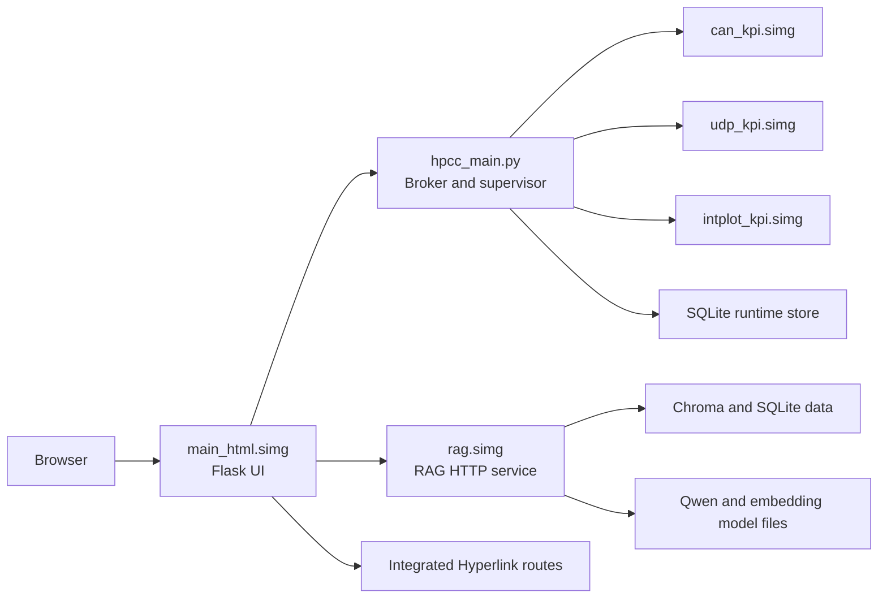

# Developer Runbook

This document is the developer-oriented runbook for the current `simg_zmq` stack.

Use it when you need to:

- understand how the runtime is put together
- identify the large artifact files shown in Git Changes
- build fresh `.simg` images and the `simg_sh_hpcc` bundle
- run the stack locally from Windows
- upload the bundle and sources to cluster storage
- run the stack on an HPCC login node
- decide when a change needs a rebuild and when a simple source sync is enough

This guide is intentionally practical. It is the shortest path from source code to a running stack, with enough architecture detail to explain why each step exists.

## 1. What The Current Stack Is

The current runtime is built around one control plane and one browser entrypoint:

- `main_html` is the single user-facing web application.
- `hpcc_main.py` is the broker and orchestrator.
- `rag.simg` is the RAG HTTP service used by dashboard chat.
- KPI work runs inside dedicated compute images.
- Hyperlink is integrated into the main web app instead of being a separate service.

At runtime the main ports are:

| Port | Owner | Purpose |
|------|-------|---------|
| `5001` | `main_html.simg` | browser UI |
| `5100` | `rag.simg` | RAG `/health` and `/ask` |
| `9100` | `hpcc_main.py` or `hpcc_main.pyz` | broker socket |

## 2. Architecture At A Glance



The stack has three logical planes.

### Experience Plane

Implemented by `main_html/`.

Responsibilities:

- login and session management
- dashboard and tool pages
- runtime map editor
- job history and logs
- Hyperlink viewer routes
- chat UI backed by RAG

### Control Plane

Implemented by `hpcc_main.py`, `hpcc_runtime_store.py`, and `main_html/runtime_store.py`.

Responsibilities:

- runtime tool registry
- process launch and supervision
- job submission and status tracking
- Windows to WSL port forwarding
- Slurm or tmux wrapper generation for compute runs

### Execution Plane

Implemented by the built images inside `simg_sh_hpcc/`.

Responsibilities:

- web UI serving
- RAG answering and ingestion
- CAN KPI compute
- UDP KPI compute
- Interactive Plot generation

## 3. Repository Areas You Actually Need

| Path | What it owns |
|------|--------------|
| `hpcc_main.py` | local broker entrypoint for Windows or dev use |
| `hpcc_runtime_store.py` | broker-side runtime metadata persistence |
| `main_html/` | main Flask UI, templates, runtime store, broker client, RAG client |
| `rag/` | RAG service implementation, ingestion logic, vector store, model config |
| `KPI/` | source for CAN KPI, UDP KPI, and Interactive Plot images |
| `Hyperlink_tool/` | integrated viewer code used by `main_html` |
| `scripts/wsl_build_hpcc_bundle.sh` | current authoritative bundle build script |
| `main_hpcc.sh` | current authoritative cluster launcher |
| `run_hpcc_stack.sh` | wrapper around `main_hpcc.sh` with logging |
| `kpi_runtime_launcher.sh` | common direct CLI entrypoint for KPI and Interactive Plot |
| `simg_sh_hpcc/` | built bundle output: images, wrappers, runtime state, and bundled source |
| `Readme/` | current documentation set |

## 4. What The Files In The Screenshot Do

The files shown in your screenshot are not source code. They are runtime artifacts, generated images, databases, or model checkpoints.

### 4.1 Built Container Images

These are generated by `scripts/wsl_build_hpcc_bundle.sh` and written into `simg_sh_hpcc/`.

| Screenshot file | Type | What it does |
|-----------------|------|--------------|
| `simg_zmq/simg_sh_hpcc/main_html.simg` | generated container image | Runs the main Flask UI on the login node. This is the browser entrypoint. |
| `simg_zmq/simg_sh_hpcc/kpi/can/can_kpi.simg` | generated container image | Runs CAN KPI processing. Used by `run_can.sh` and broker-launched KPI jobs. |
| `simg_zmq/simg_sh_hpcc/kpi/int_plot/intplot_kpi.simg` | generated container image | Runs Interactive Plot generation. Used by `run_intplot.sh`. |
| `simg_zmq/simg_sh_hpcc/kpi/udp/udp_kpi.simg` | generated container image | Runs UDP KPI processing, including ZMQ mode for combined flows. |
| `simg_zmq/simg_sh_hpcc/rag/rag.simg` | generated container image | Runs the RAG Flask service on port `5100`. |

The same filenames under `simg_zmq - Copy/` and `simg_zmq1/` mean the same thing. They are duplicate work folders carrying the same artifact types.

### 4.2 RAG Data Files

| Screenshot file | Type | What it does |
|-----------------|------|--------------|
| `rag/data/chroma/chroma.sqlite3` | database | Chroma metadata database for the RAG vector store. |
| `rag/data/chroma/<uuid>/data_level0.bin` | vector index shard | Binary HNSW or vector segment written by Chroma during ingestion. |

These are generated at runtime after ingestion. They are machine-specific runtime state, not source assets.

### 4.3 Qwen And Embedding Model Files

| Screenshot file | Type | What it does |
|-----------------|------|--------------|
| `Qwen_Qwen3.5-2B-Q5_K_S.gguf` | LLM checkpoint | Quantized GGUF Qwen model used for local inference. |
| `bge-small-en-v1.5/model.safetensors` | embedding checkpoint | Safetensors format of the BGE small embedding model. |
| `bge-small-en-v1.5/pytorch_model.bin` | embedding checkpoint | PyTorch format of the same BGE small model. |
| `bge-small-en-v1.5/onnx/model.onnx` | model export | ONNX export of the BGE small model for alternate runtimes. |
| `nomic-bert-2048/model.safetensors` | embedding base model | Safetensors format of the Nomic BERT base model. |
| `nomic-bert-2048/pytorch_model.bin` | embedding base model | PyTorch format of the same Nomic BERT base model. |
| `nomic-embed-text-v1.5/model.safetensors` | embedding checkpoint | Main safetensors checkpoint for Nomic text embeddings. |
| `nomic-embed-text-v1.5/onnx/model.onnx` | full ONNX export | Full ONNX export of the Nomic embedding model. |
| `nomic-embed-text-v1.5/onnx/model_bnb4.onnx` | quantized ONNX export | 4-bit style export for smaller memory usage. |
| `nomic-embed-text-v1.5/onnx/model_fp16.onnx` | ONNX export | fp16 export for GPU-friendly inference. |
| `nomic-embed-text-v1.5/onnx/model_int8.onnx` | ONNX export | int8 export for reduced memory usage. |
| `nomic-embed-text-v1.5/onnx/model_q4.onnx` | ONNX export | q4 quantized export. |
| `nomic-embed-text-v1.5/onnx/model_q4f16.onnx` | ONNX export | mixed q4 and fp16 export. |
| `nomic-embed-text-v1.5/onnx/model_quantized.onnx` | ONNX export | generic quantized export. |
| `nomic-embed-text-v1.5/onnx/model_uint8.onnx` | ONNX export | uint8 export. |

These are runtime model assets. They are large on purpose and should not be committed to git when they exceed repository limits.

### 4.4 Why These Files Are Still Left Out Of Git

The files above are exactly the kind of artifacts that should stay outside normal git history:

- generated `.simg` bundles are rebuildable outputs
- Chroma files are runtime database state
- GGUF and ONNX checkpoints are downloaded or staged model assets
- many of them are larger than 100 MB

That is why they were intentionally left out of the push.

## 5. Preconditions For A Clean Developer Workflow

### Windows Host

- Python 3.10 or newer
- WSL installed
- Git and SSH tools available

### WSL Or Linux Build Environment

- `apptainer` or `singularity`
- `python3`
- ability to run `sudo apptainer build` or equivalent builder permissions

### Cluster Side

- Apptainer or Singularity available on the login node
- optional Slurm for compute-backed KPI runs
- `tmux` for detached combined KPI flows

## 6. The Bare-Minimum Local Workflow

This is the fastest working path when you already have or can generate the `.simg` bundle.

### Step 1: Build The Bundle In WSL

From WSL:

```bash
cd /mnt/c/Users/ouymc2/Desktop/plotly_code/simg_zmq
bash scripts/wsl_build_hpcc_bundle.sh
```

This generates:

- `simg_sh_hpcc/main_html.simg`
- `simg_sh_hpcc/kpi/can/can_kpi.simg`
- `simg_sh_hpcc/kpi/udp/udp_kpi.simg`
- `simg_sh_hpcc/kpi/int_plot/intplot_kpi.simg`
- `simg_sh_hpcc/rag/rag.simg`
- `simg_sh_hpcc/hpcc_main.pyz`
- bundled helper scripts and `bundle_src/`

### Step 2: Start The Stack From Windows With Python

From the repo root on Windows:

```powershell
cd C:\Users\ouymc2\Desktop\plotly_code\simg_zmq
python .\hpcc_main.py
```

This is the current minimal local startup command.

### Step 3: Verify The Ports

```powershell
Invoke-WebRequest -UseBasicParsing http://127.0.0.1:5001/login
Invoke-WebRequest -UseBasicParsing http://127.0.0.1:5100/health
```

If the stack is healthy:

- UI should be reachable on `http://127.0.0.1:5001/html`
- broker should be bound on `127.0.0.1:9100`
- RAG should answer on `http://127.0.0.1:5100/health`

### Important Limitation

The runtime is Python-started locally, but image generation is not Python-only. The current image build path depends on WSL plus Apptainer or Singularity. The Python-only part begins after the images already exist.

## 7. How A Change Moves Through The System

Use this rule set.

### No Rebuild Needed

You usually only need a source sync plus restart when changing:

- `main_html/*`
- `Hyperlink_tool/*`
- templates, CSS, JS, or route logic

Reason: the deployed bundle bind-mounts `bundle_src/main_html` and `bundle_src/Hyperlink_tool`, so source changes can be refreshed without regenerating `main_html.simg`.

### Rebuild Needed

You need to rerun `scripts/wsl_build_hpcc_bundle.sh` when changing:

- `Singularity.def`
- KPI definition files under `KPI/*/*.def`
- `rag/Singularity_RAG.def`
- system-level dependencies inside an image
- `hpcc_main.py` or `hpcc_runtime_store.py` when you need a fresh bundled `hpcc_main.pyz`

## 8. Generate A Fresh HPCC Bundle

This is the authoritative current build command:

```bash
cd /mnt/c/Users/ouymc2/Desktop/plotly_code/simg_zmq
bash scripts/wsl_build_hpcc_bundle.sh
```

What it does:

1. verifies `apptainer` or `singularity` exists
2. builds all current runtime images
3. builds `hpcc_main.pyz`
4. copies `main_html` and `Hyperlink_tool` into `simg_sh_hpcc/bundle_src/`
5. copies helper scripts like `main_hpcc.sh`, `run_hpcc_stack.sh`, and `kpi_runtime_launcher.sh`

## 9. Upload The Bundle To A Cluster

There are three realistic upload paths in the current repo.

### 9.1 Python Helper For Source Sync

Use this when you want to upload source files but not images.

```powershell
cd C:\Users\ouymc2\Desktop\plotly_code\simg_zmq
pip install paramiko
python .\main_html\sync_to_cluster.py --cluster southfield --user <user> --dest <remote_project_path>
```

Important behavior of this helper:

- it excludes `.simg`
- it excludes `.env`
- it excludes caches and local DB files
- it excludes `llm_model` and `simg`

That means it is good for source sync, not for sending the large built images.

### 9.2 Python Helper For Large Image Copy

Use this when one image is too large for convenient single-copy transfer.

Example for `main_html.simg`:

```powershell
cd C:\Users\ouymc2\Desktop\plotly_code\simg_zmq
python .\main_html\parallel_copy_image.py --file .\simg_sh_hpcc\main_html.simg --host 10.192.224.131 --user <user> --dest /path/to/simg_sh_hpcc --workers 6 --chunk 200
```

What it does:

1. splits the local file into chunks
2. uploads the chunks in parallel
3. concatenates them remotely
4. verifies the remote checksum
5. removes remote chunk parts

Run it once per large image when needed.

### 9.3 Manual Full-Bundle Copy

When network conditions are fine, manual copy is simpler:

```bash
scp -r simg_sh_hpcc <user>@<cluster-host>:/path/to/
```

Or copy individual images:

```bash
scp simg_sh_hpcc/main_html.simg <user>@<cluster-host>:/path/to/simg_sh_hpcc/
scp simg_sh_hpcc/kpi/can/can_kpi.simg <user>@<cluster-host>:/path/to/simg_sh_hpcc/kpi/can/
scp simg_sh_hpcc/kpi/udp/udp_kpi.simg <user>@<cluster-host>:/path/to/simg_sh_hpcc/kpi/udp/
scp simg_sh_hpcc/kpi/int_plot/intplot_kpi.simg <user>@<cluster-host>:/path/to/simg_sh_hpcc/kpi/int_plot/
scp simg_sh_hpcc/rag/rag.simg <user>@<cluster-host>:/path/to/simg_sh_hpcc/rag/
```

### Important Note About The Older Python Deployment Helpers

`main_html/deploy.py` and `main_html/sync_to_cluster.py` still carry older `all_services` naming and default remote roots. They are useful, but for the current `simg_zmq` stack you should always pass `--dest` explicitly so you control the real target path.

## 10. Run The Bundle On The Cluster Login Node

After upload, go into the remote bundle directory:

```bash
cd /path/to/simg_sh_hpcc
chmod +x main_hpcc.sh run_hpcc_stack.sh kpi_runtime_launcher.sh
PORT=5006 HPCC_BROKER_PORT=9106 ./run_hpcc_stack.sh
```

`run_hpcc_stack.sh` is only a wrapper. It logs and then delegates to `main_hpcc.sh`.

What `main_hpcc.sh` does:

1. prepares runtime directories and logs
2. resolves the bundled broker artifact, usually `hpcc_main.pyz`
3. locates `main_html.simg`
4. loads Apptainer or Singularity if needed
5. bind-mounts bundle paths plus `/net`, `/scratch`, and `/mnt` when present
6. starts the broker
7. starts `main_html.simg`
8. optionally starts RAG depending on environment settings

Useful environment toggles:

| Variable | Meaning |
|----------|---------|
| `PORT` | web UI port, default `5002` in bundle launcher |
| `HPCC_BROKER_PORT` | broker port, default `9100` |
| `HPCC_AUTO_START_RAG` | set to `1` to auto-start RAG |
| `HPCC_PORT_CONFLICT_POLICY` | port conflict behavior, default `shift` |
| `HPCC_REQUIRE_SLURM_FOR_KPI` | require Slurm-backed KPI execution |
| `HPCC_ALLOW_LOCAL_KPI` | allow local KPI execution on login node when set |

### Access From Your Laptop

Use SSH tunneling if the login node is not directly browser-accessible:

```bash
ssh -N -L 5006:127.0.0.1:5006 <user>@<login-node>
```

Then open:

```text
http://127.0.0.1:5006/html
```

## 11. Start RAG Separately On The Cluster

If you do not auto-start RAG from `main_hpcc.sh`, start it manually:

```bash
cd /path/to/simg_sh_hpcc
./rag/run_rag.sh
```

To ingest an HTML root into the RAG pipeline:

```bash
./rag/run_rag.sh --scrap /path/to/html_root
```

`run_rag.sh` wraps `rag.simg` and chooses either talk mode or scrape mode.

## 12. Direct KPI And Interactive Plot Commands On The Cluster

All commands below are run from inside `simg_sh_hpcc/`.

### CAN KPI

```bash
./kpi/can/run_can.sh /path/to/kpi.json /path/to/output/can_run
./kpi/can/run_can.sh --hdf /path/to/input.h5 /path/to/output.h5 /path/to/output/can_run
```

### UDP KPI

```bash
./kpi/udp/run_udp.sh /path/to/kpi.json /path/to/output/udp_run
./kpi/udp/run_udp.sh --hdf /path/to/input.h5 /path/to/output.h5 /path/to/output/udp_run
./kpi/udp/run_udp.sh zmq 5560
```

### Interactive Plot

```bash
./kpi/int_plot/run_intplot.sh /path/to/ConfigInteractivePlots.xml /path/to/InputsInteractivePlot.json /path/to/output/intplot_run
```

### Combined UDP KPI And Interactive Plot

```bash
./kpi_runtime_launcher.sh --target udp_kpi --source-target udp_kpi --interactive-mode enabled --input-mode json --json-path /path/to/InputsInteractivePlot.json --config-xml /path/to/ConfigInteractivePlots.xml --output-dir /path/to/output/udp_intplot --port 5560 --detached
```

### Combined CAN KPI And Interactive Plot

```bash
./kpi_runtime_launcher.sh --target can_kpi --source-target can_kpi --interactive-mode enabled --input-mode json --json-path /path/to/InputsInteractivePlot.json --config-xml /path/to/ConfigInteractivePlots.xml --output-dir /path/to/output/can_intplot --detached
```

## 13. RAG Model Bootstrap And Why The Big Files Exist

The RAG layer needs two classes of assets:

1. embedding models
2. the Qwen GGUF chat model

The repo already includes a bootstrap helper for embedding models:

```powershell
cd C:\Users\ouymc2\Desktop\plotly_code\simg_zmq\rag
pip install -r requirements.txt
python .\download_local_models.py
```

Optional smaller embedding preset:

```powershell
python .\download_local_models.py --embedding bge-small
```

Important nuance:

- `download_local_models.py` downloads embedding assets.
- the Qwen GGUF file must still exist locally and be pointed to by `QWEN_GGUF_PATH`, or be placed in the expected runtime location.
- the large `qwn_kk_fine_model` directories in your screenshot are staged runtime model stores, not hand-written source code.

## 14. Developer Decision Table

| If you changed... | Do this |
|-------------------|---------|
| Flask routes, HTML templates, CSS, JS | sync source, restart UI |
| Hyperlink viewer code | sync source, restart UI |
| broker logic in `hpcc_main.py` | rebuild bundle so `hpcc_main.pyz` is refreshed |
| image dependencies or `.def` files | rebuild bundle |
| RAG Python code only | rebuild `rag.simg` if that code is baked into the image, or sync mounted source depending on deployment layout |
| model files or Chroma state | upload separately, do not commit to git |

## 15. Logs And Where To Look First

| Path | Meaning |
|------|---------|
| `simg_sh_hpcc/logs/hpcc_broker.log` | broker startup and orchestration logs |
| `simg_sh_hpcc/logs/main_html.log` | main UI service logs |
| `simg_sh_hpcc/logs/rag.log` | RAG service logs |
| `simg_sh_hpcc/runs/<user>/...` | per-run generated launcher, logs, and outputs |
| `simg_sh_hpcc/runtime_state/main_html/.cache_html/` | runtime SQLite DB and cache state |
| `simg_sh_hpcc/runtime_state/rag/` | RAG runtime data |

## 16. Common Problems

### Problem: port already in use

The launcher defaults to `HPCC_PORT_CONFLICT_POLICY=shift`, so it may shift to the next free port. If that happens, read the startup logs and use the shifted port.

### Problem: KPI should not run on the login node

That is expected. The current bundle defaults to Slurm-backed KPI execution and disables local KPI by default.

### Problem: large files keep showing in Git Changes

That is also expected if they are model files, Chroma DB files, or `.simg` outputs. They are runtime artifacts and should stay out of git when they exceed the repository limit.

### Problem: source changed but the cluster still shows the old UI

If the deployment uses `bundle_src/main_html` or `bundle_src/Hyperlink_tool`, sync the changed source and restart the stack. Do not rebuild unless the change touched the image definition or baked dependencies.

## 17. Recommended Read Order After This File

1. `README_hpcc_integration.md` for end-to-end operations
2. `HPCC_RUNTIME_SYSTEM_DESIGN.md` for detailed control flow
3. `README_kpi.md` for direct KPI execution on HPCC
4. `rag/SYSTEM_DESIGN.md` for RAG internals

## 18. One-Page Fast Path

If you need only the shortest sequence, use this:

### Local

```bash
# WSL
cd /mnt/c/Users/ouymc2/Desktop/plotly_code/simg_zmq
bash scripts/wsl_build_hpcc_bundle.sh
```

```powershell
# Windows
cd C:\Users\ouymc2\Desktop\plotly_code\simg_zmq
python .\hpcc_main.py
```

Open `http://127.0.0.1:5001/html`.

### Cluster

```bash
scp -r simg_sh_hpcc <user>@<cluster-host>:/path/to/
ssh <user>@<cluster-host>
cd /path/to/simg_sh_hpcc
PORT=5006 HPCC_BROKER_PORT=9106 ./run_hpcc_stack.sh
```

If you need source-only refreshes, use:

```powershell
python .\main_html\sync_to_cluster.py --cluster southfield --user <user> --dest <remote_project_path>
```

That is the current practical developer workflow.